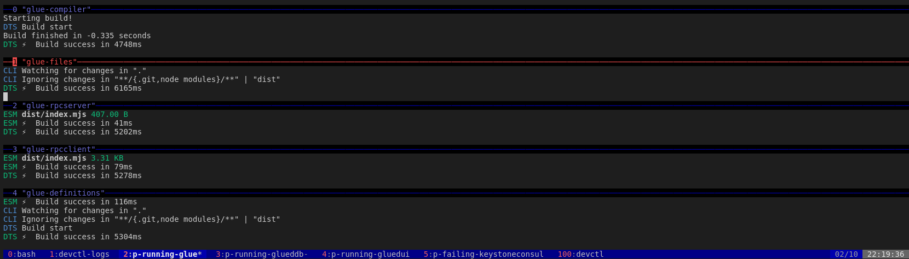

# `dev`

**If you are using this repo you should expect code to be in a half-working crude state.**

`dev` is my development environment for any new personal projects I am working on.
Once a project reaches a certain level of quality it will be graduated from this repository to one of its own.

`dev` exists because I got sick of managing containers/tooling/formatting/linting/service runners across repositories.

It provides virtual environments for Python, Go & Node.js. All 
external dependencies and rc / profile files stay within the repository, the host system shouldn't be effected.
I don't even have Node or Go installed on my machine outside of this repo :)

**Linux x86-64 only!**

### Setup instructions

Clone the repository and run `./devenv`

### Repo control with `devenv`

`devenv code` - Open VSCode

`devenv start` - Start/enter the development environment (outside of VSCode).

`devenv vendor` - Revendor all dependencies.

`devenv node_modules` - Rebuild `node_modules`.

### Project control with `devctl` (dev daemon)

`devctl` monitors projects running inside the environment and ensures they stay running.

Configure it in `devctl-config.yml`.

`devctl` - Start devd monitor (automatically started when entering the development environment)

`devctl start <proj1> <proj2>` - Start projects

`devctl stop <proj1> <proj2>` - Stop projects

`devctl start-groups <group1> <group2>` - Start a group of projects

`devctl stop-groups <group1> <group2>` - Stop a group of projects

## TODO List

This is a rolling TODO list for this repository.

## Overview

<!-- ### Netcop

#### System Hostnames

##### Service hostname format:

`<hostname>.<servicename>.service.<cluster>` .ptcc -->

<!-- 

`<boxtype>-<boxname>-<cluster>`
`<boxname>-<boxtype>-<cluster>`

`catch-absense-staple-prod-eu1`

`[<tag>.]<service>.service[.<datacenter>].<domain>` -->

<!-- # Lookup a 
`catch-absense-staple.hostd.service.eu1-PROD`

`new1box1.hostd.prod1`
`hostd.prod1` -->